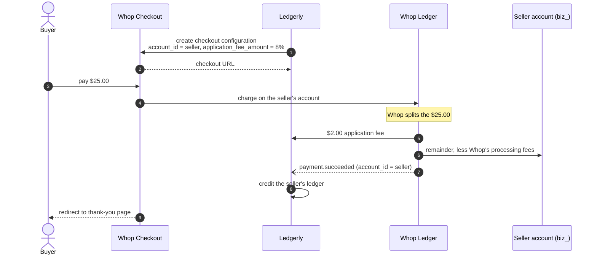
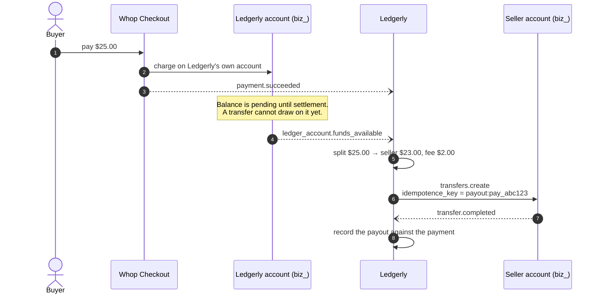

# Ledgerly Platform SDK

Connected-accounts plumbing for a Whop platform, in TypeScript. Fork it, point it
at your own store, and it does four things:

- **Idempotent onboarding** — create-or-fetch a seller's connected account from
  your own seller id, plus a hosted KYC link.
- **Checkout with an 8% application fee** — computed in integer cents, validated
  exactly, applied by Whop at charge time.
- **A webhook consumer** — verifies Standard Webhooks signatures, deduplicates on
  the message id across restarts, and routes each event to the seller it belongs to.
- **A reconciliation job** — diffs one seller's Whop payments and transfers against
  your ledger and reports what disagrees.

Requires Node 20+ and a Whop platform API key. The platforms API is invite-only —
contact Whop if you don't have access yet.

```bash
npm install
npm test
```

## Money flows

Whop supports two ways for a platform to take its cut. They differ in who holds
the money and when, which changes what you reconcile and what you owe a seller
if something goes wrong.

### Direct charge — the buyer pays the seller

The charge is created on the seller's connected account. Whop routes Ledgerly's
`application_fee_amount` to the platform and the rest to the seller, who bears
Whop's processing fees, refunds and disputes out of their share.



Ledgerly's $2.00 is fixed and knowable up front. **The seller's net is not** — it
depends on Whop's fee schedule for that account, the buyer's card, and any
currency conversion. Read it from `payments.listFees` once the payment exists
rather than estimating it.

### Transfer — the buyer pays Ledgerly

Ledgerly takes the whole charge and moves the seller's 92% afterwards. Useful
when the split isn't known at checkout time, or when the seller can't be charged
on directly.



The pending-balance step is the one that bites. `transfers.create` draws on the
platform's *available* balance and fails when the amount exceeds it, so calling
it inline on `payment.succeeded` fails for a charge that hasn't settled. Drive it
from `ledger_account.funds_available` or a scheduled sweep. (Some platform
accounts may transfer pending balance to their children —
`can_transfer_pending_balance_to_children` on the account says whether yours can.)

**Refunds.** In the direct-charge flow the refund comes out of the seller's
account. Whether Whop also reverses the application fee is account-specific —
confirm it against your own account before you decide whether Ledgerly returns
its 8%, and record whichever way you decide in your `refund.created` handler.

## Usage

### Onboarding

```typescript
import { onboardSeller, FileStore } from "ledgerly-platform";

const store = new FileStore("./seller-accounts.json"); // your database in production

const seller = await onboardSeller(
  client,
  {
    externalId: "seller_us_001",
    email: "seller@example.com",
    country: "US",
    returnUrl: "https://ledgerly.example.com/onboarding/complete",
    refreshUrl: "https://ledgerly.example.com/onboarding/refresh",
  },
  { store }
);

seller.accountId;     // biz_xxx — the same one on every call for this externalId
seller.created;       // false once the account exists
seller.onboardingUrl; // fresh every call: these links expire
```

Whop has no "find account by metadata" endpoint, so the `externalId → account id`
map in your store is what makes this idempotent — there is no server-side unique
key to lean on.

If the store is lost, `findAccountByExternalId` recovers the mapping. Note what
it cannot do: Whop's free-text `query` filter matches `title` **only**, so
searching it for an external id returns nothing for any account titled something
human — verified against a live platform, where `query: "seller_us_001"` returns
zero matches for the account carrying exactly that `metadata.external_id` under
the title "Ledgerly US Seller". Recovery therefore uses `query` as a fast path
and falls back to paging every connected account and matching on metadata. That
scan is capped; hitting the cap throws rather than returning "not found", because
"not found" would make the caller create a duplicate.

The one race this cannot close on its own: two concurrent calls for the same
unmapped `externalId` both find nothing and both create. Back `KeyValueStore`
with a table whose key column is `UNIQUE` and reserve the key before calling, and
the database closes it. A file cannot express that constraint.

### Checkout

```typescript
import { createCheckout } from "ledgerly-platform";

const checkout = await createCheckout(client, {
  sellerAccountId: seller.accountId,
  productTitle: "Premium Course",
  price: 25.0,
  currency: "usd",
  redirectUrl: "https://ledgerly.example.com/thanks",
});

checkout.applicationFee; // 2 — exactly 8%, to the cent
```

Fees are computed in integer cents and converted back only at the API boundary,
because `100.1 * 0.08` is `8.008000000000001` and a fee that fails an equality
check against itself is a support ticket. `validateApplicationFee` is exact — no
tolerance — since a fee a cent off is a fee something else computed.

A price small enough that 8% rounds to zero throws: Whop requires a positive
`application_fee_amount`, so a $0.05 sale cannot carry this fee at all.

### Webhooks

```typescript
import { WebhookConsumer, FileStore, WebhookVerificationError } from "ledgerly-platform";

const consumer = new WebhookConsumer({
  secret: process.env.WHOP_WEBHOOK_SECRET!, // verbatim, `ws_` prefix included
  store: new FileStore("./seller-accounts.json"),
});

consumer.on("payment.succeeded", async ({ event, sellerAccountId, externalId }) => {
  // externalId is your seller id, resolved through the same store onboarding wrote.
});

// In your route handler — raw body, not a re-serialized one:
const result = await consumer.handle(await request.text(), headers);
```

Verification goes through the SDK's own `unwrapWebhook`, which handles a detail
that is easy to get wrong by hand: Whop HMACs with the literal bytes of the `ws_`
secret, while the `standardwebhooks` library base64-decodes whatever key it is
given, so the secret has to be base64-encoded first to cancel that out. Pass the
secret exactly as Whop displays it and the helper does the rest.

**Answer 400 on `WebhookVerificationError`** — a bad signature never becomes good,
so there is nothing to retry. **Answer 5xx when a handler throws**, so Whop
redelivers.

Delivery is at-least-once. A message id is recorded only after its handler
resolves, so a crash mid-handler means the retry runs it again — the safe
direction to fail, but it does mean **your handlers must be idempotent too**. Key
your writes on `event.id` or on the payment id inside `event.data`.

Register the webhook with `child_resource_events` enabled, or the platform only
receives its own events and never its sellers'.

### Reconciliation

```typescript
import { reconcileSeller, formatReport } from "ledgerly-platform";

const report = await reconcileSeller(client, {
  sellerAccountId: "biz_xxx",
  localLedger: rows, // [{ id, kind, amount, currency, status }]
  since,
  until,
  normalizeStatus: (status) => statusMap[status] ?? status,
});

report.discrepancies; // missing_in_ledger | missing_in_whop | amount_mismatch |
                      // currency_mismatch | status_mismatch
```

Two things worth knowing:

**It throws on API errors, deliberately.** Catching them and returning an empty
result set makes every local row look `missing_in_whop`, and an empty ledger
against a failed fetch reports a clean reconciliation. An outage you can see beats
a green report that means nothing.

**Reconcile closed windows.** A record created while the job runs can land on one
side of the diff and not the other. `until` should be in the past.

Payment amounts arrive as exact decimal strings and are parsed straight to cents;
`Number("0.1") * 100` is `10.000000000000002`, which is the error the string
representation exists to avoid.

## Layout

```
src/
  money.ts              integer-cent arithmetic and exact decimal parsing
  store.ts              KeyValueStore interface, file and memory implementations
  onboarding.ts         create-or-fetch a connected account + onboarding link
  checkout.ts           8% fee calculation and checkout creation
  webhook-consumer.ts   signature verification, deduplication, seller routing
  reconciliation.ts     Whop vs. local ledger diff
  transfers.ts          the transfer flow's 92/8 split
tests/                  node:test; signatures are really signed and verified
examples/               runnable scripts for each flow
```

`FileStore` is the default because it makes the examples runnable with no
infrastructure. It is single-process only — two processes rewriting the same file
clobber each other — and rewrites the whole file per key. Implement
`KeyValueStore` against your own database before production; both idempotency
guarantees then rest on your database's constraints rather than a local file's.

## Configuration

Copy `.env.example` to `.env`. The platform API key needs `company:create`,
`company:read`, `checkout:create`, `payment:read`, `transfer:create`,
`transfer:read` and `account_link:create`.

## Testing

```bash
npm test
```

53 tests, no network. Webhook signatures are genuinely signed with
`standardwebhooks` and verified through the real path, so the suite fails if the
secret encoding, header names or timestamp tolerance drift. Whop API calls run
against stubs that mirror the shapes in `@whop/sdk`'s types.

### Verified against a live sandbox

Every call this SDK makes has been run against a real Whop platform account, not
just against the SDK's types. What that run established:

| Call | Result |
|---|---|
| `accounts.retrieve` / `list` (incl. `query`, cursor `first`) | accepted |
| `accountLinks.create` | accepted — real hosted KYC link returned |
| `checkoutConfigurations.create` with `application_fee_amount` | accepted |
| `payments.list` (`account_id`, `created_after`/`_before`) | accepted |
| `transfers.list` (`destination_id`) | accepted |
| `onboardSeller` idempotency, incl. recovery from an empty store | same account, no duplicate |
| Reconciliation against a real payment | clean match, and correct diffs when perturbed |

**The 8% fee is really applied.** `application_fee_amount` is not echoed back by
`checkoutConfigurations.retrieve`, so acceptance alone proves nothing. Sending a
fee larger than the price settles it — Whop rejects it specifically:

> `Application fee amount must be less than the total payment amount ($25.00)`

Whop reads and validates the field. It is stored, merely not returned. That
constraint is also enforced client-side, so the error surfaces before the round
trip.

Two API limits found this way and now guarded in code rather than discovered in
production: a plan `title` is capped at **30 characters** (Whop reports it as
"Failed to create dynamic plan", which does not name the field), and
`transfers.list` **400s** without `origin_id` or `destination_id`.

Not verified: `accounts.create` (needs a real, deliverable email address — Whop
rejects `example.com`) and `transfers.create` (needs a settled balance).

What the suite does **not** cover: any real call to Whop. For that, put a key in
`.env` and run the read-only smoke test, which lists and retrieves but creates
nothing:

```bash
cp .env.example .env   # then add your key
npm run smoke          # optionally: npm run smoke -- biz_a_seller_account
```

It exercises every read path this SDK uses — `accounts.list` pagination, the
free-text `query` filter onboarding recovery depends on, and the `account_id` /
`destination_id` filters and date windows reconciliation sends — and reports
which shapes Whop accepted. The write paths (create account, checkout, transfer)
are still only covered by the examples.

## License

MIT — see [LICENSE](LICENSE).
